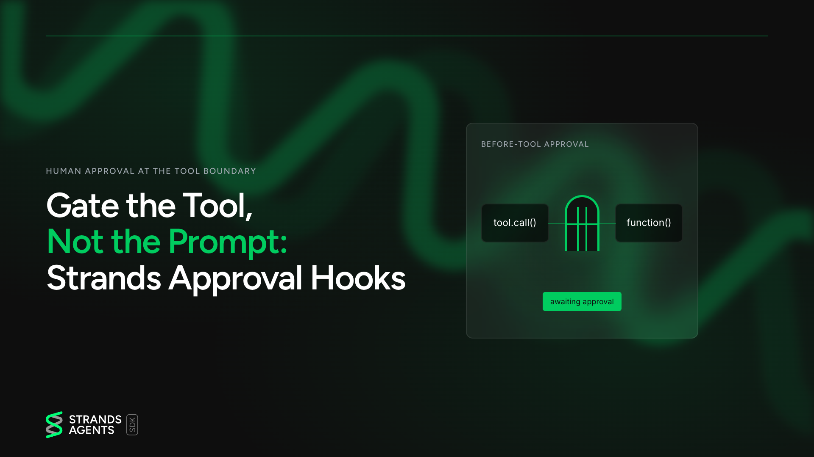

# sample-strands-approval-gate



This is a sample for experiments, not production code. It accompanies the blog post
"Gate the Tool, Not the Prompt: Strands Approval Hooks" and shows one thing:
a before-tool hook in Strands Agents that pauses the agent with an interrupt until a human
approves a destructive tool call, and cancels the call otherwise.

## What it does

- `approval_gate.py` registers an `ApprovalHook` on `BeforeToolCallEvent`.
- When the model asks for `delete_files`, the hook calls `event.interrupt(...)` and the agent
  returns with `stop_reason == "interrupt"`.
- The caller answers the interrupt (from the `APPROVE` environment variable so the script runs
  unattended) and resumes the agent.
- On resume the same `event.interrupt(...)` call returns the answer. Anything other than `y`
  or `yes` sets `event.cancel_tool`, and the tool never executes.

The `delete_files` tool is a fake: it prints `TOOL EXECUTED` and removes nothing.

## The resume loop, line by line

The blog post shows the hook. The loop that answers it lives in `main()` and does four things:

1. **Build the agent with the hook attached.** `Agent(..., hooks=[ApprovalHook()], tools=[delete_files], callback_handler=None)`.
   Passing `hooks=` keeps registration next to the provider that owns it, and `callback_handler=None`
   silences the default streaming printer so the trace lines are the script's own.
2. **Make the first call and read `stop_reason`.** `result = agent("delete /tmp/a.txt and /tmp/b.txt")`
   returns with `stop_reason == "interrupt"` instead of `"end_turn"`, because the hook paused the agent
   before `delete_files` ran.
3. **Answer every pending interrupt that is ours.** `result.interrupts` is `Sequence[Interrupt] | None`,
   so the loop iterates `result.interrupts or ()`. Each interrupt carries `id`, `name` and the `reason`
   the hook attached. Other hooks can raise their own interrupts, so the loop skips any whose `name`
   is not `INTERRUPT_NAME`. For ours, it appends one `InterruptResponseContent`:
   `{"interruptResponse": {"interruptId": interrupt.id, "response": approve}}`. The response must be
   JSON-serializable and keyed on the interrupt id so the SDK routes it back to the right pause.
4. **Resume by calling the agent with the responses in place of a prompt.** `result = agent(responses)`.
   The hook's `event.interrupt(...)` now returns the answer, the tool runs or is cancelled, and the
   model finishes its turn. The `while result.stop_reason == "interrupt"` guard repeats steps 3 and 4
   if the model asks again.

Two consequences worth knowing before you copy the loop: a `None` response does not deny, it re-raises
the same interrupt and the loop spins; and a cancelled call still costs a full event-loop cycle because
the model receives and answers the error tool result. Both are in [NOTES.md](NOTES.md) with the traces
that show them.

## Run it

Requires Python 3.13, [uv](https://docs.astral.sh/uv/), AWS credentials with Amazon Bedrock
access, and a model you have verified in your own account:

```bash
aws bedrock list-inference-profiles --region eu-central-1 \
  --query 'inferenceProfileSummaries[].inferenceProfileId' --output text
```

The script defaults to `eu.anthropic.claude-sonnet-5` in `eu-central-1`. Point it at your own
verified profile and region with environment variables, then run:

```bash
export MODEL_ID=YOUR_MODEL
export AWS_REGION=YOUR_AWS_REGION
uv sync
APPROVE=y uv run python approval_gate.py   # tool runs once
APPROVE=n uv run python approval_gate.py   # tool never runs
```

Look for the `TOOL EXECUTED` line. It appears in the approved run and is absent in the denied run.

## Checks

```bash
uv run ruff check approval_gate.py
uv run ruff format --check approval_gate.py
uv run mypy --strict approval_gate.py
```

## Certification run

One check decides whether the gate holds. `check_gate.sh` runs the script with `APPROVE=y` and
`APPROVE=n` against Bedrock and asserts on the printed trace: exactly one `TOOL EXECUTED` line in
the approved run, none in the denied run, and `FINAL   stop_reason=end_turn` in both. It prints
PASS or FAIL per assertion and exits non-zero on any FAIL.

```bash
./check_gate.sh
```

The two runs behind the blog post are in [TRACES.md](TRACES.md), pasted as printed.

## Links

- [Strands Agents interrupts](https://strandsagents.com/docs/user-guide/sdk/interrupts/)
- [Strands Agents hooks](https://strandsagents.com/docs/user-guide/sdk/agents/hooks/)
- [Hook events](https://strandsagents.com/docs/user-guide/sdk/agents/hooks-events/)
- NOTES.md: the deep dive (typing corrections, limits, the AfterToolsEvent edge, what the traces showed)
